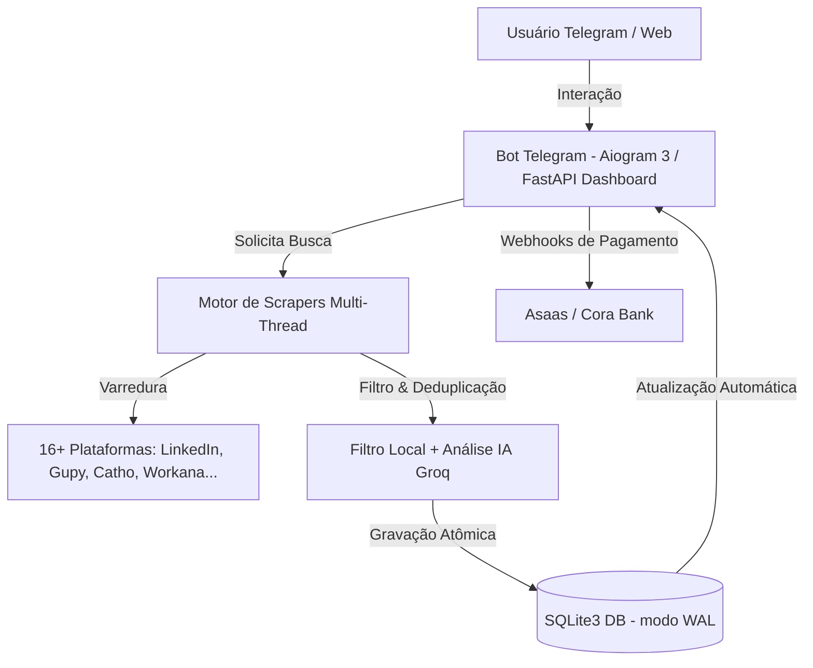

# 🎯 Vagas Sniper Bot — Central de Vagas & Automação Inteligente (SaaS + Telegram Bot)

> **Plataforma Completa de Varredura de Oportunidades, Análise de Compatibilidade por IA e Notificação Instantânea em Tempo Real.**

---

## 📋 Sumário
1. [Sobre o Projeto](#-sobre-o-projeto)
2. [Arquitetura do Sistema](#-arquitetura-do-sistema)
3. [Estrutura de Arquivos & Módulos](#-estrutura-de-arquivos--módulos)
4. [Plataformas Monitoradas (Scrapers)](#-plataformas-monitoradas-scrapers)
5. [Pré-Requisitos de Instalação](#-pré-requisitos-de-instalação)
6. [Configuração do Ambiente (.env)](#-configuração-do-ambiente-env)
7. [Como Executar Localmente ou em Servidor (VPS)](#-como-executar-localmente-ou-em-servidor-vps)
8. [Segurança, Banco de Dados & Produção](#-segurança-banco-de-dados--produção)
9. [Suporte & Contato](#-suporte--contato)

---

## 🎯 Sobre o Projeto

O **Vagas Sniper Bot** é uma solução Full-Stack em Python projetada para capturar, filtrar e organizar vagas de emprego e projetos freelance de **16+ plataformas brasileiras e internacionais** simultaneamente.

O sistema integra:
- **Bot Nativo do Telegram (Aiogram 3):** Interface de busca, envio de currículo em PDF, análise de senioridade e alertas em tempo real.
- **Console Web & Dashboard (FastAPI + HTML5/Vanilla JS):** Interface responsiva para visualização de vagas, filtros por estado (27 UFs do Brasil) e modalidades (Remoto, Híbrido, Presencial).
- **Motor de Inteligência Artificial (Groq / OpenRouter / Llama 3.1):** Análise de compatibilidade candidato-vaga e auxílio em candidaturas.
- **Banco de Dados Concorrente (SQLite3 com modo WAL):** Alta performance para leitura/escrita simultânea sem travamentos.

---

## 🏗️ Arquitetura do Sistema



---

## 📁 Estrutura de Arquivos & Módulos

```text
vagas_bot/
├── app.py                      # Servidor Web FastAPI, rotas de API, Webhooks e Middlewares de Segurança
├── bot.py                      # Bot do Telegram principal (Handlers, Menus, Leitura de PDF e Fluxos)
├── database.py                 # Camada de Persistência SQLite3 com PRAGMA WAL, Tabelas e Transações Atômicas
├── ai_module.py                # Integração com APIs de LLM (Groq / OpenRouter) para Análise e Match
├── auto_apply.py               # Módulo de Automação de Candidaturas e Pré-preenchimento
├── requirements.txt            # Lista de Dependências Python
├── .env                        # Arquivo de Variáveis de Ambiente (Segredos e Tokens)
├── static/                     # Painel Frontend Web (HTML5, CSS3, JS Vanilla, Ícones)
│   └── index.html              # Interface do Dashboard do Vagas Sniper Console
├── scrapers/                   # Módulos Individuais de Coleta de Vagas
│   ├── linkedin.py             # Scraper LinkedIn (Filtros de Modalidade e Nível)
│   ├── gupy.py                 # Scraper Gupy (Paginação e Mapeamento de Carreiras)
│   ├── catho.py                # Scraper Catho (Busca Expandida por Palavra-chave)
│   ├── infojobs.py             # Scraper InfoJobs
│   ├── workana.py              # Scraper Workana (Playwright Stealth Anti-Bot)
│   ├── glassdoor.py             # Scraper Glassdoor
│   ├── indeed.py               # Scraper Indeed
│   ├── programathor.py         # Scraper ProgramaThor
│   ├── remotar.py              # Scraper Remotar
│   ├── geekhunter.py           # Scraper GeekHunter
│   ├── coodesh.py              # Scraper Coodesh
│   ├── github_vagas.py         # Scraper GitHub Vagas BR
│   ├── jooble.py               # Scraper Jooble
│   ├── novenove.py             # Scraper 99Freelas
│   ├── freelancer.py           # Scraper Freelancer.com
│   └── vagas_com.py            # Scraper Vagas.com
├── tests/                      # Suíte de Testes Automatizados e Regressão
│   ├── test_security.py        # Testes de Segurança HTTP, Webhooks e CORS
│   └── test_location_uf.py     # Testes de Filtros por Estado (27 UFs)
├── Ligar_Robos.bat             # Iniciador Automático para Ambiente Windows
└── iniciar_invisivel.vbs       # Script VBScript para Execução em Segundo Plano
```

---

## 🌐 Plataformas Monitoradas (Scrapers)

| Categoria | Plataformas Integradas |
| :--- | :--- |
| **Freelance & Projetos** | Workana, 99Freelas, Freelancer.com |
| **CLT & Corporativo** | Gupy, Catho, InfoJobs, Vagas.com, Indeed, Glassdoor |
| **Tech, Dev & Remoto** | LinkedIn, Remotar, ProgramaThor, GeekHunter, Coodesh, GitHub Vagas BR, Jooble |

---

## 🛠️ Pré-Requisitos de Instalação

- **Python 3.10 ou superior** instalado no sistema.
- **Navegador Chromium (Playwright)** para scrapers com proteção anti-bot.

---

## 🔑 Configuração do Ambiente (.env)

Crie um arquivo `.env` na raiz do projeto contendo as seguintes chaves de configuração:

```env
# Configurações do Telegram Bot
TELEGRAM_BOT_TOKEN=seu_token_do_bot_aqui
ADMIN_TELEGRAM_ID=seu_chat_id_telegram

# Chaves de Inteligência Artificial
GROQ_API_KEY=gsk_sua_chave_groq_aqui
OPENROUTER_API_KEY=sk-or-sua_chave_openrouter_aqui

# Segredo do Webhook de Pagamento (Asaas / Cora)
PAYMENT_WEBHOOK_SECRET=super_secret_webhook_key_2026

# Configurações de Porta e Ambiente
PORT=8000
ENVIRONMENT=production
```

---

## 🚀 Como Executar Localmente ou em Servidor (VPS)

### 1. Clonar o Repositório e Instalar Dependências

```bash
# Entrar no diretório do projeto
cd vagas_bot

# Criar ambiente virtual
python -m venv venv

# Ativar o ambiente virtual
# No Windows:
venv\Scripts\activate
# No Linux/macOS:
source venv/bin/activate

# Instalar dependências
pip install -r requirements.txt

# Instalar navegadores do Playwright
playwright install chromium
```

### 2. Iniciar o Servidor Web (FastAPI) e o Bot (Telegram)

#### No Windows:
Você pode dar duplo clique no arquivo `Ligar_Robos.bat` ou executar via terminal:

```bash
python app.py
```

#### Em Servidor Linux (VPS / Ubuntu) usando PM2 ou Systemd:

```bash
# Iniciar a aplicação Web e Bot via PM2
pm2 start app.py --name "vagas-sniper" --interpreter ./venv/bin/python
```

Acesse o Dashboard no navegador: `http://localhost:8000` (ou o IP do seu servidor).

---

## 🛡️ Segurança, Banco de Dados & Produção

- **Banco de Dados SQLite3 WAL:** Configurado nativamente com `PRAGMA journal_mode=WAL;` e `PRAGMA busy_timeout=5000;` em `database.py` para suportar alta concorrência de leitura e escrita.
- **Proteção Anti-Clickjacking & Anti-XSS:** Headers de segurança configurados via middleware em `app.py`.
- **Autenticação em Webhook de Pagamento:** Validação estrita usando `hmac.compare_digest()` e persistência de idempotência por `payment_id`.
- **Testes Automatizados:** Para rodar a verificação de segurança e filtros:
  ```bash
  python test_security.py
  python test_location_uf.py
  ```

---

## 📞 Suporte & Contato

- **Desenvolvedor:** Diego
- **WhatsApp:** (43) 99165-2706 / [Link WhatsApp](https://wa.me/5543991652706)
- **Telegram:** [@CATDIEGO](https://t.me/CATDIEGO)
- **E-mail:** `9919622diego@gmail.com`
